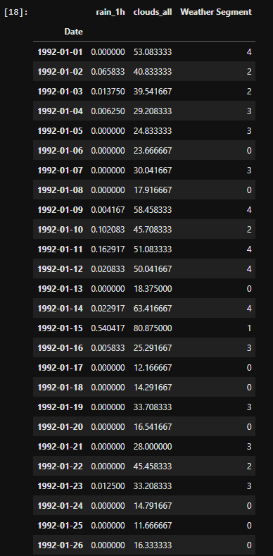
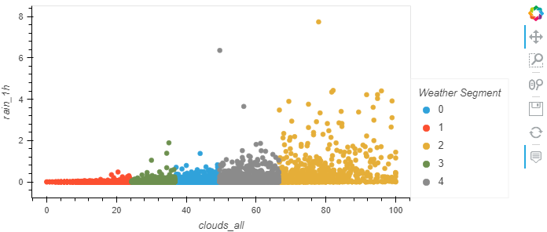
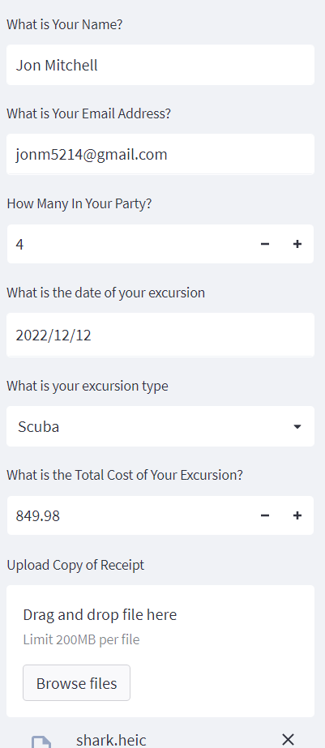
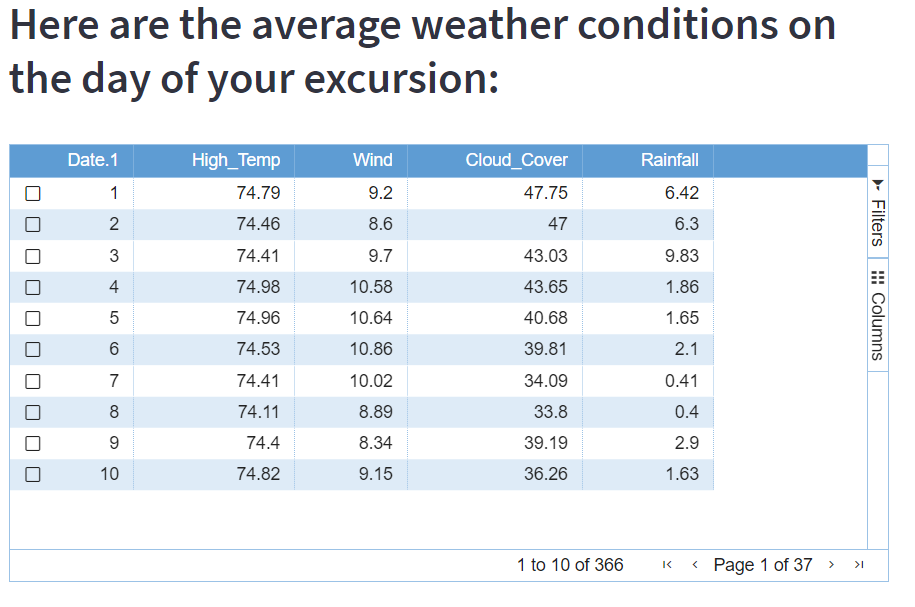
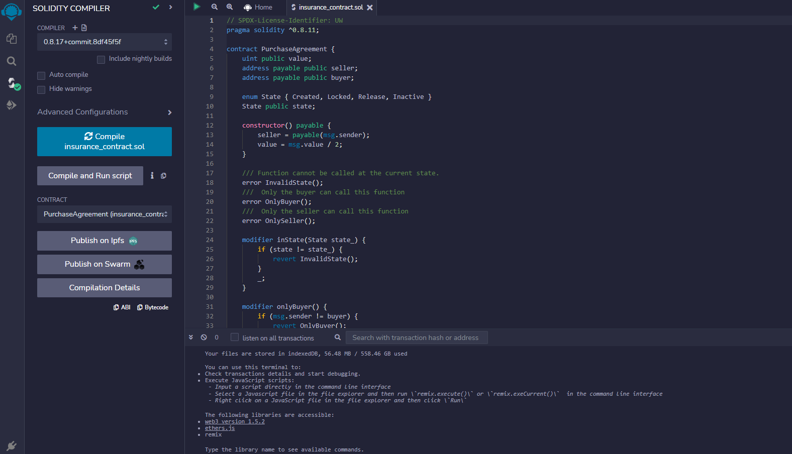
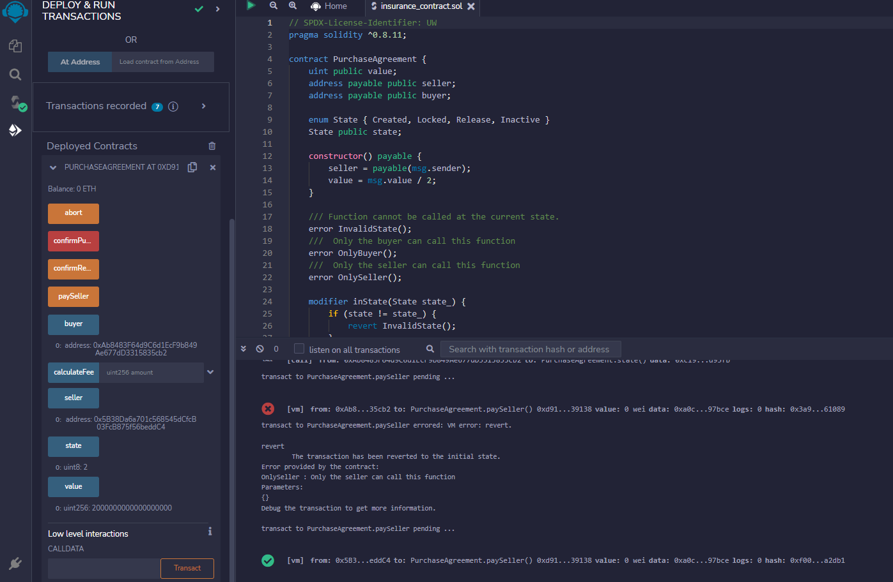
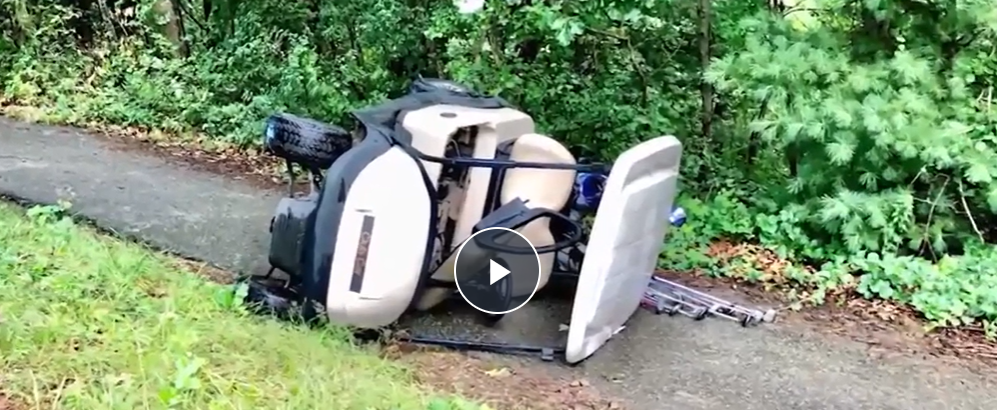
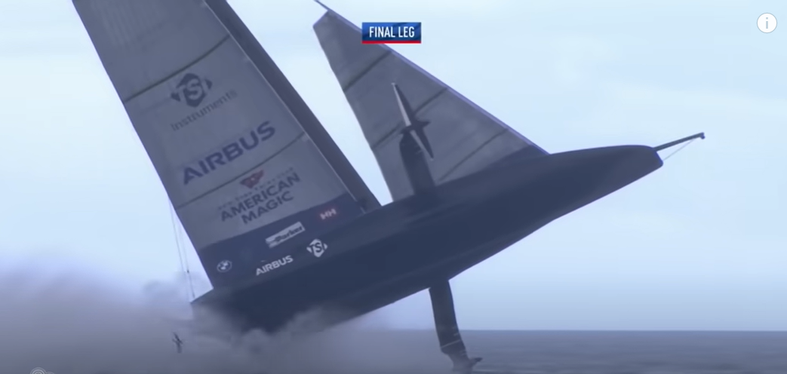

# Excursion_Insurance
UW Fintech Capstone Project  

--- 

# ExcurAssure Insurance

The purpose of this application is to allow consumers to protect their investment in excursions while on vacation.  Many times exursions are non-refundable, and people are forced to attend an event in poor weather.  Imagine being motion sick and having to go snorkeling when the seas are rough, of having to golf when the winds are howling 35MPH.  Not a great way to spend a day of vacation, but you don't want to lose the $1,000 you spent.  Enter Exur-Assure.  

Based on the parameters that the user enters we will look at the historical weather results for that day and offer an insurance policy that covers your group against bad weather.  You will be issued an NFT that works as a certificate of insurance and if you file a claim you will be reimbursed accordingly

---

## Technologies

This project incorporates the following software applications:
  - Python (for developing code / analyzing data)
  - Streamlit (for client interaction)
  - Solidity (for developing smart contracts)
  - Ubuntu (for configuring Ethereum node to host blockchain)
  
Libraries used include:  
  - Pandas 
  - JSON
  - OS
  - SKLEARN
  - st_aggrid (new libarary for manipulating dataframes within Streamlit)  

---

## Utilizing Application

30 years of weather data was pulled from openweather via a .csv download, and with that we utilized machine learning to develop predicitions for weather on a particular day:
  
  
  
  
  
With Weather properly compiled we shift focus to the customer interface.  

Ask them to provide travel details:
  
  

We then anlayze the historical weather averages for that day using st_aggrid:
  
  
  
  
If customer decides to purhcase insurance we create a smart contract:
  
  
  
  
  

---

## Use Case 

Excur-Assure is intended to be supplemental insurance for when the excursion company does not offer a refund.  For example a golf course would only close if it got so much rain or there was thunder in the area, but the customer might want to got a museum on a rainy day instead of play golf.  This way they can get the majority of the their fees refunded and use that money to do something more weather appropriate. 
  
  
Another example might be a sailing exursion, but the group has motion sickness so rough seas might not stop the trip, but this way the customer could use the money to rent beach chairs and umbrellas instead
  
  
To maintain security and prevent fraud, all transactions will be hosted on the blockchain via an ethereum node. This way once the contract is issued it is final and cannot be manipulated.  In order for the customer to collect, they must redeem the NFT (certificate of insurance).  We will verify with tour operator that they were a no-show, and issue payment via the buy-back of the NFT. 

---

## Contributors

Brought to you by Sam Eberts, Jon Kang, Tracy Kellison Emory, Jon Mitchell, Souk Phoumiphak.

---

## License 

Copyright 2022 

Permission is hereby granted, by approval only and access of a copy of this software and associated documentation files (the "Software"), to deal in the Software without restriction, including without limitation the rights to use, copy, modify, merge, publish, distribute, sublicense, and/or sell copies of the Software, and to permit persons to whom the Software is furnished to do so, subject to the following conditions:

The above copyright notice and this permission notice shall be included in all copies or substantial portions of the Software.

THE SOFTWARE IS PROVIDED "AS IS", WITHOUT WARRANTY OF ANY KIND, EXPRESS OR IMPLIED, INCLUDING BUT NOT LIMITED TO THE WARRANTIES OF MERCHANTABILITY, FITNESS FOR A PARTICULAR PURPOSE AND NONINFRINGEMENT. IN NO EVENT SHALL THE AUTHORS OR COPYRIGHT HOLDERS BE LIABLE FOR ANY CLAIM, DAMAGES OR OTHER LIABILITY, WHETHER IN AN ACTION OF CONTRACT, TORT OR OTHERWISE, ARISING FROM, OUT OF OR IN CONNECTION WITH THE SOFTWARE OR THE USE OR OTHER DEALINGS IN THE SOFTWARE.
